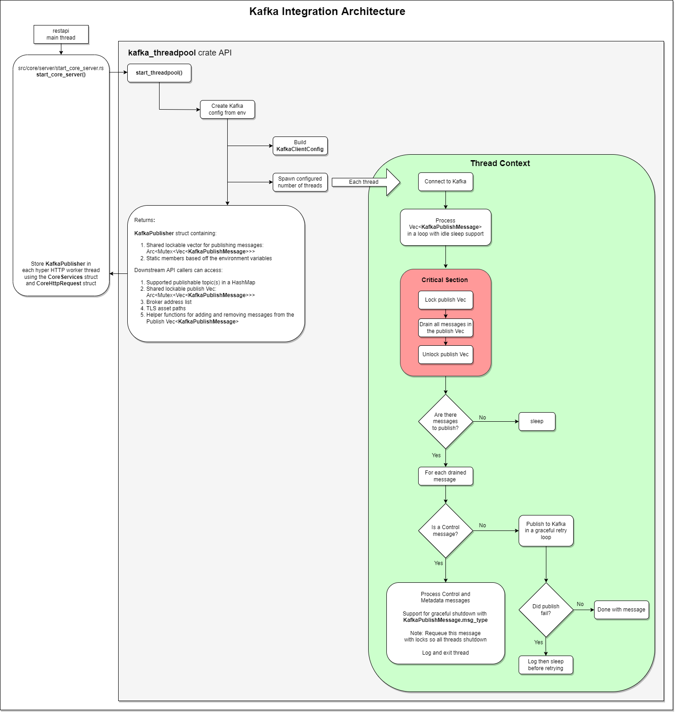

# Kafka Threadpool for Rust with mTLS Support

An async rust threadpool for publishing messages to kafka using ``SSL`` (mTLS) or ``PLAINTEXT`` protocols.

## Architecture

This is a work in progress. The architecture will likely change over time. For now here's the latest reference architecture:



## Background

Please refer to the [blog post](https://jaypjohnson.com/2022-09-19-designing-a-high-performance-rust-threadpool-for-kafka-with-mtls.html) for more information on this repo.

## Configuration

### Supported Environment Variables

| Environment Variable Name        | Purpose / Value                                |
| -------------------------------- | ---------------------------------------------- |
| KAFKA_ENABLED                    | toggle the kafka_threadpool on with: ``true`` or ``1`` anything else disables the threadpool | 
| KAFKA_LOG_LABEL                  | tracking label that shows up in all crate logs | 
| KAFKA_BROKERS                    | comma-delimited list of brokers (``host1:port,host2:port,host3:port``) |
| KAFKA_TOPICS                     | comma-delimited list of supported topics |
| KAFKA_PUBLISH_RETRY_INTERVAL_SEC | number of seconds to sleep before each publish retry |
| KAFKA_PUBLISH_IDLE_INTERVAL_SEC  | number of seconds to sleep if there are no message to process |
| KAFKA_NUM_THREADS                | number of threads for the threadpool |
| KAFKA_TLS_CLIENT_KEY             | optional - path to the kafka mTLS key |
| KAFKA_TLS_CLIENT_CERT            | optional - path to the kafka mTLS certificate |
| KAFKA_TLS_CLIENT_CA              | optional - path to the kafka mTLS certificate authority (CA) |
| KAFKA_METADATA_COUNT_MSG_OFFSETS | optional - set to anything but ``true`` to bypass counting the offsets |

## Getting Started

Please ensure your kafka cluster is running before starting. If you need help running a kafka cluster please refer to the [rust-with-strimzi-kafka-tls repo](https://github.com/jay-johnson/rust-with-strimzi-kafka-and-tls) for more details.

### Set up the Environment Variables

You can create an ``./env/kafka.env`` file storing the environment variables to make your producer and consumer consistent (and ready for podman/docker or kubernetes):

```bash
export KAFKA_ENABLED=1
export KAFKA_LOG_LABEL="ktp"
export KAFKA_BROKERS="host1:port,host2:port,host3:port"
export KAFKA_TOPICS="testing"
export KAFKA_PUBLISH_RETRY_INTERVAL_SEC="1.0"
export KAFKA_NUM_THREADS="5"
export KAFKA_TLS_CLIENT_CA="PATH_TO_TLS_CA_FILE"
export KAFKA_TLS_CLIENT_CERT="PATH_TO_TLS_CERT_FILE"
export KAFKA_TLS_CLIENT_KEY="PATH_TO_TLS_KEY_FILE"
export KAFKA_METADATA_COUNT_MSG_OFFSETS="true"
```

#### Load the Environment

```bash
source ./env/kafka.env
```

### Start the Kafka Threadpool and Publish 100 Messages

The included [./examples/start-threadpool.rs](https://github.com/jay-johnson/rust-kafka-threadpool/blob/main/examples/start-threadpool.rs) example will connect to the kafka cluster based off the environment configuration and publish 100 messages into the kafka ``testing`` topic.

```bash
cargo build --example start-threadpool
export RUST_BACKTRACE=1
export RUST_LOG=info,kafka_threadpool=info,rdkafka=info
./target/debug/examples/start-threadpool
```

### Consume Messages

To consume the newly-published test messages from the ``testing`` topic, you can use your own consumer or the [rust-with-strimzi-kafka-and-tls/examples/run-consumer.rs](https://github.com/jay-johnson/rust-with-strimzi-kafka-and-tls/blob/main/examples/run-consumer.rs) example:

```bash
# from the rust-with-strimzi-kafka-and-tls directory:
cargo build --example run-consumer
export RUST_BACKTRACE=1
export RUST_LOG=info,rdkafka=info
./target/debug/examples/run-consumer -g rust-consumer-testing -t testing
```

### Get Kafka Cluster Metadata for All Topics, Partitions, ISR, and Offsets

Run the [./examples/get-all-metadata.rs](https://github.com/jay-johnson/rust-kafka-threadpool/blob/main/examples/get-all-metadata.rs) example:

```bash
cargo build --example get-all-metadata
export RUST_BACKTRACE=1
export RUST_LOG=info,kafka_threadpool=info,rdkafka=info
./target/debug/examples/get-all-metadata
```

### Get Kafka Cluster Metadata for a Single Topic including Partitions, ISR and Offsets

1.  Set the Topic Name as an Environment Variable

    ```bash
    export KAFKA_TOPIC=testing
    ```

1.  Run the [./examples/get-metadata-for-topic.rs](https://github.com/jay-johnson/rust-kafka-threadpool/blob/main/examples/get-metadata-for-topic.rs) example:

    ```bash
    cargo build --example get-metadata-for-topic
    export RUST_BACKTRACE=1
    export RUST_LOG=info,kafka_threadpool=info,rdkafka=info
    ./target/debug/examples/get-metadata-for-topic
    ```
